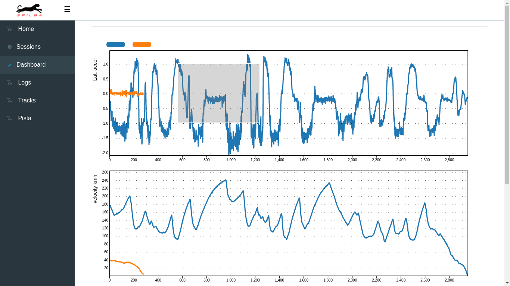
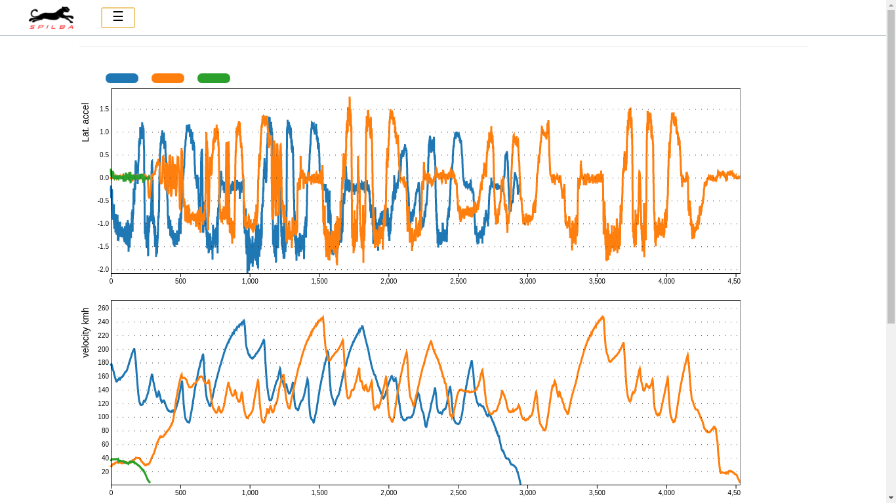

# SD: Spilba Desktop


**SD** Repo Privado del proyecto Spilba Desktop


## Cómo ejecutar la App ?

### Pre-Requisitos

```
Download Node.js desde: https://nodejs.org/en/download/
```

### Ejecucion 
En la carpeta en la cuál se haya clonado el Repositorio, correr:

```
npm install
npm run build
```

Cada vez que se quiera ejecutar la APP, correr:

```
npm start
npm run electron
```

Al correr los comandos previos, debería verse la App:





### Road Map 1° Versión Funcional
- ~~Tracks~~ _bloqueado x POSITION INDEX_ :fire: :fire: :fire: :exclamation:
- ~~Componente Pista (secciona log en Tracks)~~  _bloqueado x POSITION INDEX_ :fire: :fire: :fire: :exclamation: 
- Habilitar Channel
- Habilitar Activate/Deactivate Log
- Habilitar Delete Log
- Habilitar Add Tracks
- Habilitar Delete Tracks
- Ejecutable

### Backlog
- Dashboard Configurable
- Video
- Ejes simultáneos
- Canales matemáticos
- Backend
- Sincronización Backend
- Position Index
- Zoom Eje-Y
- Filtros Digitales
- App Auto Upgrade
- Publicidad productos Spilba en App

### Status al 12/08/2018
Se incorpora deteccion y seleccion de Channels. **_Queda pendiente POSITION INDEX (Algoritmo, Zips, etc...)_**.

### Status al 08/08/2018
Se logro generar ejecutable .deb (Linux). Se descartaron fallas en parseo de .vbo's. Se agrego descripcion de cada channel dibujado en Dashboard.

### Status al 18/07/2018
En este momento, la App es capaz de interpretar archivos .vbo, guardarlos en base de datos. También permite TAGgear cada archivo para su posterior búsqueda. Tanto el zoom como el shift horizontal, son funcionales. Programáticamente se deja deshabilitada la funcionalidad de SHIFT. Es necesario encontrar o definir una manera de pasar de modo SHIFT a modo ZOOM. Al día de hoy, se muestran 3 canales harcodeados. Los datos surgen de los archivos, pero los canales están predefinidos en el código.

### Status al 25/05/2018
Se incorpora el componente que describe las líneas dibujadas en cada canal. Este habilitará el modo SHIFT para permitir el corrimiento en el eje X de la curva seleccionada.

### Status al 29/04/2018
Los gráficos interactúan entre sí en cuánto a la respuesta al Zoom en eje X. En términos de ReactJS, esto último se logra mediante el dispatch de acciones que transforman el estado de la APP. La funcionalidad básica de Zoom en los gráficos, está funcional. Pueden haber errores o correcciones de borde que haya que efectuar. La idea es que puedan jugar con la App en el estado actual y probar estas características. De acá en adelante, lo primero a realizar es la integración con el componente FileExplorer (que desarrolló Ale), de modo que un evento en ese componente, genere cambios en la visualización de los gráficos.


### Status al 23/03/2018 
Se agregan los gráficos que se toman del estado inicial de la App. Estos van a obtenerse de la interacción con el FileExplorer. 
Los gráficos no incorporan el Zoom, resta transformarlo de .js a reactJS. 
El estado inicial se lee desde el archivo initialState.js. Esto deberá cambiar y tomarlo desde CouchDB o desde el Storage que corresponda. 
Los reducers interactúan con (y actualizan) el estado de la App, de manera de permitir la integración de todos los componentes a mostrar.
