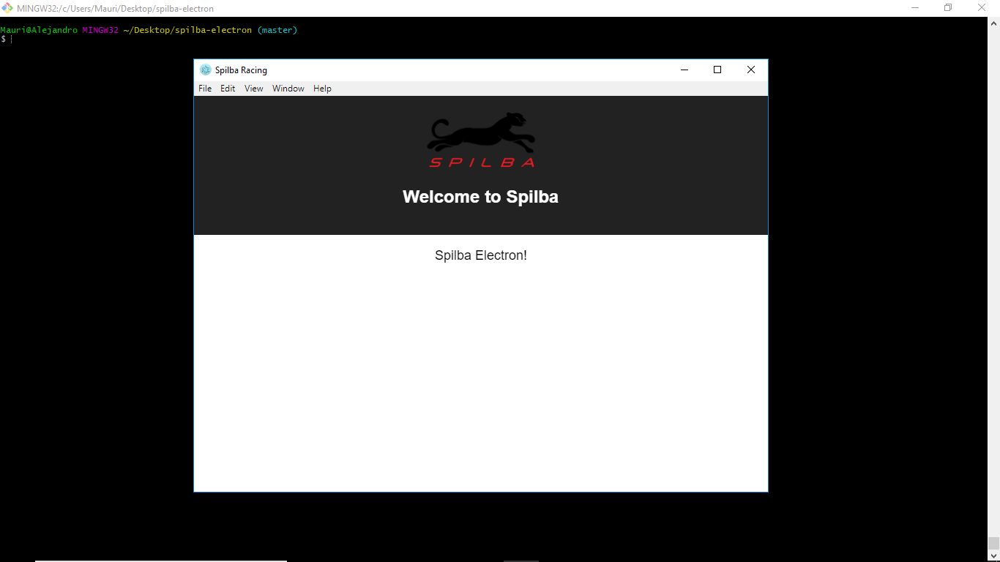

# SpilbaDesktop
Repo Privado del proyecto Spilba Desktop


## Cómo ejecutar la App ?

### Pre-Requisitos

```
Download Node.js desde: https://nodejs.org/en/download/
```

### Ejecucion 
En la carpeta en la cuál se haya clonado el Repositorio, correr:

```
npm install
npm run build
```

Cada vez que se quiera ejecutar la APP, correr:

```
npm start
npm run electron
```

Al correr los comandos previos, debería verse la App:



### Status al 23/03/2018 
Se agregan los gráficos que se toman del estado inicial de la App. Estos van a obtenerse de la interacción con el FileExplorer. 
Los gráficos no incorporan el Zoom, resta transformarlo de .js a reactJS. 
El estado inicial se lee desde el archivo initialState.js. Esto deberá cambiar y tomarlo desde CouchDB o desde el Storage que corresponda. 
Los reducers interactúan con (y actualizan) el estado de la App, de manera de permitir la integración de todos los componentes a mostrar.
