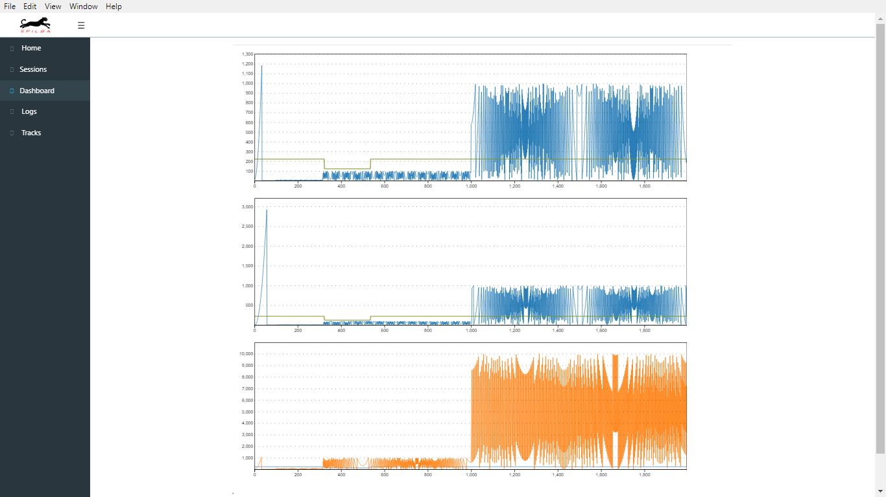

# SpilbaDesktop
Repo Privado del proyecto Spilba Desktop


## Cómo ejecutar la App ?

### Pre-Requisitos

```
Download Node.js desde: https://nodejs.org/en/download/
```

### Ejecucion 
En la carpeta en la cuál se haya clonado el Repositorio, correr:

```
npm install
npm run build
```

Cada vez que se quiera ejecutar la APP, correr:

```
npm start
npm run electron
```

Al correr los comandos previos, debería verse la App:


### Status al 30/04/2018
Se inicia la etapa de integración entre el modelo de datos, el layout de la App y la funcionalidad de Zoom. Se crea nuevo branch "integracion" para separar estas tareas y, eventualmente, converger en master, una vez estabilizado el desarrollo.


### Status al 29/04/2018
Los gráficos interactúan entre sí en cuánto a la respuesta al Zoom en eje X. En términos de ReactJS, esto último se logra mediante el dispatch de acciones que transforman el estado de la APP. La funcionalidad básica de Zoom en los gráficos, está funcional. Pueden haber errores o correcciones de borde que haya que efectuar. La idea es que puedan jugar con la App en el estado actual y probar estas características. De acá en adelante, lo primero a realizar es la integración con el componente FileExplorer (que desarrolló Ale), de modo que un evento en ese componente, genere cambios en la visualización de los gráficos.


### Status al 23/03/2018 
Se agregan los gráficos que se toman del estado inicial de la App. Estos van a obtenerse de la interacción con el FileExplorer. 
Los gráficos no incorporan el Zoom, resta transformarlo de .js a reactJS. 
El estado inicial se lee desde el archivo initialState.js. Esto deberá cambiar y tomarlo desde CouchDB o desde el Storage que corresponda. 
Los reducers interactúan con (y actualizan) el estado de la App, de manera de permitir la integración de todos los componentes a mostrar.
